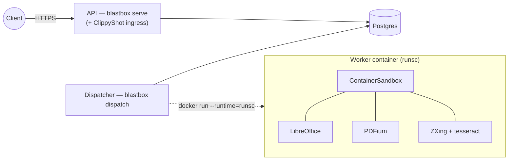
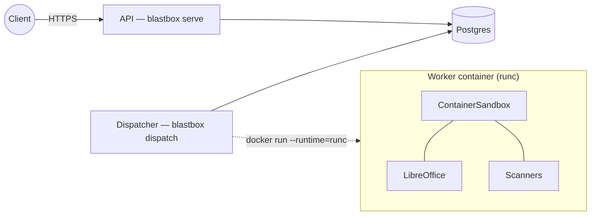
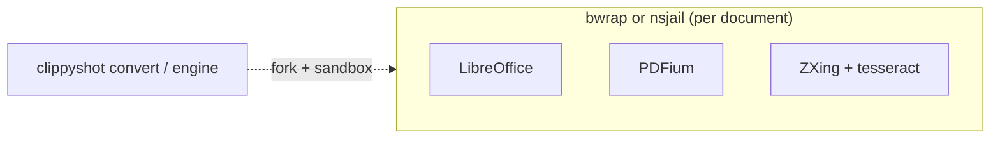
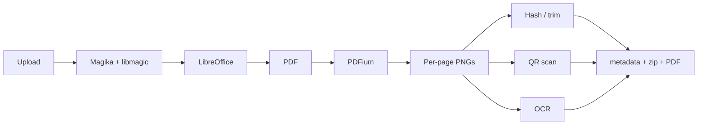

# ClippyShot

<p align="center">
  
</p>

Sandboxed office-document → image rasterizer.

ClippyShot takes a Microsoft Office, OpenDocument, or text-family file and
produces a deterministic set of per-page PNGs plus a `metadata.json`
manifest. Conversion runs LibreOffice headless inside a hardened sandbox —
one of three auto-selected backends (`nsjail`, `bwrap`, or `container`) —
with macros, scripting, Java, network egress, OLE link updates, and remote
resource fetching all disabled. PDFs are then rasterized via **PDFium**
(`pypdfium2`) by default, or poppler `pdftoppm`
(`CLIPPYSHOT_RASTERIZER=pdftoppm`).

ClippyShot ships the conversion **engine**, the rendering pipeline, the
`convert`/`selftest` CLI, and a small **web UI**. The HTTP API, job queue,
dispatch, and per-job worker isolation are provided by
[**blastbox.host**](https://github.com/wmetcalf/blastbox), which runs
ClippyShot as a pluggable engine: the Compose stack's `api` service is
`blastbox serve` with ClippyShot's ingress extension mounted, and the
`dispatcher` is `blastbox dispatch` launching one hardened worker container
per job. Host/runtime knobs are therefore `BLASTBOX_*`; the engine's own
render knobs stay `CLIPPYSHOT_*` (see [Configuration](#configuration)).

By default each job cold-starts `soffice --convert-to`. With
`CLIPPYSHOT_WARM_UNO=1`, `ClippyShotEngine.warmup()` starts a persistent
`unoserver` and hands it to the runner, which then converts through it (the
warm-UNO path, `clippyshot.libreoffice.uno`) — paying the ~750 ms soffice boot
once rather than per job. Output is pixel/byte-identical to the cold path
(validated across calc, impress, and draw families), and any warm failure falls
back to cold `--convert-to`. The warm path engages only when an engine runs
`warmup()` first (blastbox's Firecracker microVM and gVisor checkpoint/restore
warm-snapshot tiers are what drive it); it is inert otherwise.

The intended use case is taking untrusted user-uploaded documents from a
web service, rendering them safely on a worker, and serving the result as
images.

🎶 [Theme song](https://suno.com/s/2PVm6rdBfu3ooG9K)

## Quick start

### Docker Compose stack (recommended, works out of the box)

Only requires Docker 20.10+ with Compose v2. Nothing to install on the
host beyond that.

```sh
./deploy/docker/clippyshot-compose up --build -d
```

The wrapper auto-detects your host's docker-socket GID (varies across
distros — 110 on Ubuntu, 999 on Debian, 984 on RHEL) and writes it to
`deploy/docker/.env` so the dispatcher container can read the socket.
Every other argument is passed straight through to `docker compose`,
so `./deploy/docker/clippyshot-compose logs -f dispatcher`,
`./deploy/docker/clippyshot-compose down`, etc. all work as expected.

If you'd rather not use the wrapper:
```sh
export DOCKER_GID=$(stat -c %g /var/run/docker.sock)
docker compose -f deploy/docker/docker-compose.yml up --build -d
```

Web UI + API at <http://localhost:8001/>.

Each worker is fully isolated in its own short-lived gVisor (`runsc`)
container; plain `runc` is fail-closed and refused unless the operator
sets `BLASTBOX_ALLOW_RUNC=1`.

The stack brings up:
- `api` on `http://localhost:8001` — `blastbox serve` with ClippyShot's
  ingress extension (typed-artifact routes + web UI). No Docker socket.
- `dispatcher` — `blastbox dispatch`: claims queued jobs from Postgres and
  launches one worker container per job. Only component with Docker socket
  access.
- `postgres` — a custom `postgres:16-alpine` image with `pg_bktree` compiled
  in (powers perceptual-hash `/v1/similar` search), on a private internal
  network with no host-exposed port.
- a persistent named volume for the database, plus a **host-consistent
  bind-mount** for the shared job/artifact tree (`/var/lib/clippyshot` by
  default) — required so dispatcher-launched workers can bind-mount each job
  directory by its host path.

Each worker is launched with `--network=none --cap-drop=ALL
--security-opt=no-new-privileges --read-only` plus blastbox-managed
memory / pids / cpu / nofile caps (`BLASTBOX_WORKER_*`, auto-sized to the
host when unset), the input bind-mounted read-only, and `metadata.json`
validated by the dispatcher before being trusted. The input file is
deleted from the shared volume immediately after conversion.

Two optional **warm-pool sidecar** overlays add a low-latency tier alongside
the cold dispatcher — each a dedicated, socket-less dispatcher that claims
jobs and never cold-falls-back:
- `docker-compose.firecracker.yml` — a Firecracker microVM snapshot pool
  (`dispatcher-fc`; needs `/dev/kvm`).
- `docker-compose.gvisor.yml` — a `runsc` checkpoint/restore pool
  (`dispatcher-gvisor`; KVM-less).

```sh
./deploy/docker/clippyshot-compose -f deploy/docker/docker-compose.yml \
    -f deploy/docker/docker-compose.gvisor.yml up -d dispatcher-gvisor
```

For stricter deployment, install gVisor (the dispatcher prefers it
automatically) and/or load the ClippyShot AppArmor + seccomp profiles — see
`deploy/docker/README.md#hardening`.

### Single-container Docker conversion

```sh
docker build -f deploy/docker/Dockerfile -t clippyshot:dev .
docker run --rm \
    --read-only \
    --cap-drop=ALL \
    --security-opt=no-new-privileges \
    --tmpfs /tmp:rw,exec,nosuid,size=512m \
    --tmpfs /var/lib/clippyshot:rw,nosuid,size=64m,uid=10001,gid=10001 \
    -v "$PWD":/work \
    clippyshot:dev convert /work/input.docx -o /work/out
```

Note: on Ubuntu 24.04+ hosts you must first load the AppArmor profiles in
`deploy/apparmor/` to allow `nsjail` and `bwrap` to create user namespaces
inside the container. See `deploy/apparmor/README.md` for the procedure.

See `deploy/docker/README.md` for the full reference — environment
variables, hardening knobs (gVisor, custom seccomp JSON, custom AppArmor
profile), and a bare-metal / local nsjail-or-bwrap setup guide.

### Local development

```sh
python3 -m venv .venv
.venv/bin/pip install -e .[dev]
.venv/bin/pytest tests/unit tests/cli tests/http
```

The unit/cli/http suite runs without LibreOffice or a working sandbox; the
integration suite (`tests/integration`) requires both and is intended to
run inside the Docker image.

To exercise the Compose stack locally:

```sh
export DOCKER_GID=$(stat -c %g /var/run/docker.sock)
docker compose -f deploy/docker/docker-compose.yml up --build
```

To stop it and remove the containers:

```sh
docker compose -f deploy/docker/docker-compose.yml down
```

## Architecture

Three sandbox backends are available: **nsjail** and **bwrap** for bare-metal
or VM hosts where AppArmor user-namespace profiles are loaded, and
**container** for Docker/OCI deployments where the container itself provides
namespace isolation, dropped capabilities, read-only rootfs, and seccomp —
making nested bwrap/nsjail redundant. The best available backend is
auto-selected at startup via a `/bin/true` smoketest before being accepted.
Override with `CLIPPYSHOT_SANDBOX=nsjail|bwrap|container`.

The conversion pipeline is composed of small, independently-testable
modules wired together by `clippyshot.converter.Converter`:

| Module | Responsibility |
|---|---|
| `clippyshot.detector` | Magika-primary content-type detection with extension fallback + zip/XML structural sanity |
| `clippyshot.libreoffice.profile` | Hardened `UserInstallation` generator |
| `clippyshot.libreoffice.runner` | soffice argv builder + sandbox dispatch (+ optional warm-UNO fast path) |
| `clippyshot.libreoffice.uno` | warm `unoserver` lifecycle + `unoconvert` conversion (parity-preserving; opt-in) |
| `clippyshot.sandbox.{base,bwrap,nsjail,container,detect}` | Sandbox protocol + three backends + auto-selection |
| `clippyshot.rasterizer.{base,pdfium,pdftoppm}` | PDF → per-page PNG via PDFium (default) or pdftoppm |
| `clippyshot.hasher` / `clippyshot.trimmer` | pHash + colorhash + SHA-256 and the trimmed/focused derivatives |
| `clippyshot.qr` / `clippyshot.ocr` | ZXing QR/barcode scan + image-gated tesseract OCR (both non-fatal) |
| `clippyshot.converter` | The orchestration layer |
| `clippyshot.engine` | `ClippyShotEngine` — wraps the pipeline as a blastbox `Engine` (cold + warm `warmup()`), mapping output onto the blastbox artifact contract |
| `clippyshot.blastbox_ingress` | Ingress extension: ClippyShot's typed-artifact routes (PDF + per-page PNGs) and web UI, mounted onto `blastbox serve` |
| `clippyshot.cli` | argparse CLI: `convert`, `selftest`, `version`, `setup-sandbox` |
| `clippyshot.setup_sandbox` | Detect/load the scoped AppArmor userns profiles for bwrap/nsjail |
| `clippyshot.observability` | structlog + prometheus_client |
| `clippyshot.selftest` | Deployment health check |

The HTTP API, job queue, dispatch, and worker lifecycle are provided by
**blastbox.host**; ClippyShot plugs in as the engine plus an ingress
extension. The resulting process split is:

- **API** — `blastbox serve` with ClippyShot's ingress extension: uploads, job status, artifact serving. No Docker socket.
- **Dispatcher** — `blastbox dispatch`: claims jobs, prefers `runsc` (refuses plain `runc` unless `BLASTBOX_ALLOW_RUNC=1`), launches one worker container per job. The only component with the Docker socket.
- **Worker** — `python -m blastbox.worker.cold` with `BLASTBOX_ENGINE=clippyshot.engine:ClippyShotEngine`: one job, one mounted directory, no Postgres credentials.

## Deployment modes

Five shipping shapes, trading setup effort for isolation depth. The first
two run the full service (blastbox.host's API + dispatcher + per-job worker
containers); the last three are one-shot `clippyshot convert` invocations
where the outer container or the host *is* the boundary:

| Mode | Outer boundary | Inner sandbox | Seccomp | AppArmor profile required | Works on |
|---|---|---|---|---|---|
| Compose + gVisor (runsc) | `runsc` per-job container | `ContainerSandbox` | `runsc` + docker-default | none | anywhere Docker + gVisor run |
| Compose + runc | `runc` per-job container | `ContainerSandbox` | docker-default | none | anywhere Docker runs |
| Single container `convert` (inner bwrap/nsjail) | `docker run` | `bwrap` or `nsjail` inside | libseccomp or KAFEL | `clippyshot-{bwrap,nsjail}` on host kernel | Linux w/ unprivileged userns |
| Bare-metal `convert` (bwrap) | — | `bwrap` | libseccomp BPF | `clippyshot-bwrap` + `clippyshot-soffice` | AppArmor distros, kernel ≥ 3.8 |
| Bare-metal `convert` (nsjail) | — | `nsjail` | KAFEL DSL | `clippyshot-nsjail` + `clippyshot-soffice` | AppArmor distros + source build |

**Pick Compose + gVisor** unless you have a specific reason not to — it has the lowest host-assumption count, the best blast-radius story (gVisor intercepts syscalls at the VM-like boundary), and works on RHEL/SUSE/etc. where AppArmor isn't a thing. The bare-metal `clippyshot convert` paths are for embedding the renderer where running Docker isn't acceptable; nsjail specifically adds KAFEL-expressed seccomp and `--cgroup-pids` ergonomics at the cost of needing a from-source build.

### Compose + gVisor (runsc) — recommended



Hardening on each tier, outside→in:
- **API container** — read-only rootfs, `cap-drop=ALL`, `no-new-privileges`, no Docker socket, only Postgres + job-artifact access.
- **Dispatcher container** — same, plus `/var/run/docker.sock` to launch workers. No PII handling.
- **Worker container** — read-only rootfs, `--network=none`, unprivileged UID, plus an operator-attached seccomp profile (`BLASTBOX_SECCOMP_JSON_HOST`, image ships one at `/etc/clippyshot/seccomp.json`) and AppArmor profiles (`BLASTBOX_APPARMOR_PROFILES`) when configured.
- **gVisor (runsc)** — syscall-level interception; LibreOffice never talks to the host kernel directly.
- **ContainerSandbox** — in-process checks that NoNewPrivs, Seccomp, and cap-drop are effective before LO starts.
- **LibreOffice** — MacroSecurity=3, Java/OLE/updates/network all disabled.

### Compose + runc (no gVisor)



Same topology minus gVisor's syscall-interception layer. blastbox treats plain `runc` as fail-closed: the dispatcher refuses to launch a `runc` worker unless `BLASTBOX_ALLOW_RUNC=1` (and `BLASTBOX_REQUIRE_SECURE_RUNTIME=1` forbids it outright, even then). Inside the worker, the ContainerSandbox's hardening checks read `/proc/self/status`; runsc virtualises that file (so it opts into the lenient self-check automatically), runc doesn't — so a `runc` worker also needs `CLIPPYSHOT_WARN_ON_INSECURE=1`.

### Bare-metal / embedded (`clippyshot convert`)



No Docker dependency. The `clippyshot convert` CLI (and the in-process engine) runs each document in a fresh `bwrap` (or `nsjail`) subprocess with its own user/mount/PID/IPC/UTS/cgroup/network namespaces, dropped caps, seccomp-BPF (bwrap) or KAFEL (nsjail), rlimits, and the `clippyshot-soffice` AppArmor profile attached to soffice (the pdfium rasterizer opts out — that profile can't describe its venv). To expose this over HTTP, run blastbox.host in front of it rather than a built-in server. On Ubuntu 24.04+ this needs the shipped `clippyshot-{bwrap,nsjail,soffice}` AppArmor profiles loaded once — run **`clippyshot setup-sandbox`** to detect what's needed and `clippyshot setup-sandbox --apply` to load the scoped userns profiles via sudo (or load them by hand per `deploy/apparmor/README.md`).

### Shared pipeline (all modes)



`hash` covers pHash + colorhash + SHA-256 and the trimmed/focused derivatives. OCR is gated by default to pages carrying raster images, vector drawings, or an empty PDF text layer (override with `ocr_all=1`).

Notes that matter in practice:
- On **Ubuntu 24.04+**, unprivileged user namespaces are restricted by default (`kernel.apparmor_restrict_unprivileged_userns=1`). bwrap/nsjail won't work until the shipped `deploy/apparmor/clippyshot-{bwrap,nsjail}` profiles are loaded. See `deploy/apparmor/README.md`.
- AppArmor-specific — on **RHEL/Fedora/Arch**, the `aa-exec` wrapper is a no-op (not installed), so the `clippyshot-soffice` MAC layer drops off; namespace + seccomp + caps still apply.
- **nsjail inside Docker** is difficult — AppArmor profiles attach by host-visible binary path, and the container overlay path doesn't match. Compose avoids this by using `ContainerSandbox` (no nested userns) under `runsc`.
- Seccomp policies are x86_64-only today (syscall numbers hardcoded in `deploy/seccomp/clippyshot.seccomp.policy`). arm64 would need revalidation.

## Defense in depth

Each layer is independently sufficient against most attacks; together they
compose:

1. **Magika-validated input type** — malformed-on-purpose files are rejected
   before LibreOffice sees them. PDF bytes saved as `.docx` get rejected
   with `unsupported_type`.
2. **Hardened LibreOffice profile** — macros, OfficeBasic, Java, update
   checks, and remote resources are disabled at the application layer via
   `registrymodifications.xcu` and `javasettings_Linux_X86_64.xml`.
3. **bwrap / nsjail sandbox** — namespace isolation (user, mount, PID, IPC,
   UTS, cgroup, network), no capabilities, no network, rlimits on memory,
   CPU, fsize, nofile. The sandbox is the only thing soffice sees.
4. **AppArmor profiles** (when loaded) — kernel MAC layer enforcing file,
   network, exec, and ptrace restrictions independent of the sandbox. The
   `clippyshot-soffice` profile covers both the LibreOffice run and the
   QR/OCR scanners (they execute under the same profile; the scanner PNG
   mount is read-only at `/sandbox/scan`). See `deploy/apparmor/`.
5. **Unprivileged container user** + **read-only rootfs** — even if every
   layer above were compromised, the blast radius is confined to a tmpfs
   inside an unprivileged container.

Additional input-handling hardening, split across the blastbox.host ingress
and ClippyShot's detector:

- **(blastbox.host ingress)** Over-size uploads are rejected with HTTP 413
  before any body is read (Content-Length check) or as soon as the streaming
  body exceeds the limit (chunked uploads), and client-supplied filenames are
  sanitized to a safe basename so path traversal via filename is not
  possible. The ingress also owns auth and artifact path-confinement;
  ClippyShot's ingress extension adds no security logic of its own.
- **(ClippyShot detector)** Files that Magika labels as `zip` or `xml`
  (generic container labels) are structurally sanity-checked before the
  extension-fallback path trusts them. Zip-bombs (compression ratio > 100:1,
  > 5000 entries, or missing `[Content_Types].xml`) and billion-laughs XML
  (more than 64 entity declarations) are rejected at the detector.
- The engine honours all `CLIPPYSHOT_*` render overrides via
  `Limits.from_env()`, matching the `clippyshot convert` CLI; the subset a
  client may set per-job (the scanner toggles) is allowlisted on the host via
  `BLASTBOX_ENGINE_CLIPPYSHOT_PARAM_KEYS` (default-deny).

## Configuration

ClippyShot's own render/limit knobs funnel through
`clippyshot.limits.Limits.from_env()` (sandbox, scanner, and warm-UNO knobs
are read directly); host/runtime knobs are `BLASTBOX_*` and belong to
blastbox.host. **[`docs/CONFIGURATION.md`](docs/CONFIGURATION.md) is the full
`CLIPPYSHOT_*` reference** (and links to blastbox's `BLASTBOX_*` reference);
the most common ones:

| Env var | Default | Effect |
|---|---|---|
| `CLIPPYSHOT_SANDBOX` | _(auto)_ | Force `nsjail`, `bwrap`, or `container`; fail loudly if unavailable |
| `CLIPPYSHOT_INNER_NONO` | off | Optional nested **Landlock** (nono) layer inside the selected backend — opt-in defense-in-depth on runc + the FC guest (fails fast under gVisor, which has no Landlock). See `docs/CONFIGURATION.md`. |
| `CLIPPYSHOT_TIMEOUT` | `60` | Per-conversion soffice timeout (seconds) |
| `CLIPPYSHOT_MAX_PAGES` | `50` | Page count cap (truncates beyond this) |
| `CLIPPYSHOT_DPI` | `150` | Rasterization DPI |
| `CLIPPYSHOT_RASTERIZER` | `pdfium` | PDF→PNG engine: `pdfium` (PDFium/pypdfium2, ~2× faster) or `pdftoppm` (poppler) |
| `CLIPPYSHOT_WARM_UNO` | `0` | When `1`, `engine.warmup()` starts a persistent `unoserver` and the runner converts through it (parity-preserving; fail-closed to cold). Inert without `warmup()` |
| `CLIPPYSHOT_MAX_INPUT` | `104857600` | Max accepted upload size (100 MiB) |
| `CLIPPYSHOT_MEM` | `8589934592` | Per-conversion RLIMIT_AS / VADDR cap (8 GiB — soffice mmaps 4–8 GB at ~500 MB RSS; the container `--memory` is the real RSS cap) |
| `CLIPPYSHOT_TMPFS` | `1073741824` | Per-conversion tmpfs / RLIMIT_FSIZE cap (1 GiB) |
| `BLASTBOX_DATABASE_URL` | _(host knob)_ | Job-metadata backend, owned by blastbox.host; Compose sets it to `postgresql://…` |

## Supported formats

ClippyShot accepts any document format LibreOffice can render. The detector
classifies inputs by content (via Magika) and falls back to the extension
allowlist below when Magika returns a generic container label.

**Microsoft Office (OOXML):** `.docx`, `.docm`, `.dotx`, `.dotm`,
`.xlsx`, `.xlsm`, `.xltx`, `.xltm`, `.xlsb`,
`.pptx`, `.pptm`, `.ppsx`, `.ppsm`, `.potx`, `.potm`

**Microsoft Office (legacy):** `.doc`, `.dot`, `.xls`, `.xlt`, `.ppt`, `.pps`, `.pot`

**OpenDocument:** `.odt`, `.ott`, `.fodt`, `.ods`, `.ots`, `.fods`,
`.odp`, `.otp`, `.fodp`, `.odg`, `.otg`, `.fodg`

**Text / markup:** `.rtf`, `.txt`, `.csv`, `.md`

**Microsoft XPS:** `.xps`, `.oxps`

Macro-enabled formats (`.docm`, `.xlsm`, `.pptm`, `.dotm`, `.xltm`, `.ppsm`,
`.potm`, `.xlsb`) are accepted: ClippyShot's hardened LibreOffice profile
prevents macros from running (`MacroSecurityLevel=3`,
`DisableMacrosExecution=true`), and a `macro_enabled_format` warning is
recorded in `metadata.warnings` so downstream consumers can apply their own
audit policy.

## QR / OCR scanners

Rendered pages can be scanned for QR codes (via `zxing-cpp`) and OCR'd
(via `tesseract`) as part of the pipeline. Output ends up under
`pages[].qr` and `pages[].ocr` in `metadata.json` and is always present
(possibly empty) so downstream consumers can rely on a stable shape.

**Defaults:** QR scanning is **on**; OCR is **off**. QR is cheap enough
(median ~300ms/page in our test corpus) to justify running by default on
untrusted content. OCR is opt-in because it is the single most expensive
stage when enabled.

**Enable per-request** by submitting to `POST /v1/jobs` with `engine=clippyshot`
and repeated `params` fields (the UI checkboxes do exactly this). Each `params`
entry is a `CLIPPYSHOT_*=value` pair; only the allowlisted scanner keys
(`BLASTBOX_ENGINE_CLIPPYSHOT_PARAM_KEYS`) are forwarded to the worker:

```sh
curl -F "file=@doc.pdf" -F "engine=clippyshot" \
     -F "params=CLIPPYSHOT_QR=1" -F "params=CLIPPYSHOT_OCR=1" \
     http://localhost:8001/v1/jobs
```

**Or globally** by setting the engine's environment on the worker
(`CLIPPYSHOT_QR`, `CLIPPYSHOT_OCR`, `CLIPPYSHOT_OCR_ALL`, `CLIPPYSHOT_OCR_LANG`,
`CLIPPYSHOT_OCR_PSM`, `CLIPPYSHOT_OCR_TIMEOUT_S`) — baked into the cold-worker
image or supplied as operator defaults. A per-job `params` value always wins
over the global default.

### Image-gating

`ocr=1` defaults to **"only OCR pages where OCR would add signal"** —
specifically any page that (a) carries raster images, (b) contains
vector drawings, charts, stamps, or other non-text graphics, or (c)
has an empty PDF text layer (scanned PDFs). The threat-analysis use
case needs OCR anywhere there's visual content beyond pure text,
because malicious payloads frequently live in diagrams, QR-like
shapes, or overlay drawings the PDF text layer can't see.

Pure-text pages with a populated text layer and zero drawings are
skipped with `ocr.skipped="no_images"` because running tesseract on
them would just duplicate the existing text.

Set `ocr_all=1` to override the gating entirely and OCR every non-blank
page, regardless of signal. `render.image_page_count` and
`render.total_image_count` in the output help you decide which mode to
pick.

### Budget semantics

`ocr_timeout_s` (default 60s) is a **total per-job wall-clock budget**,
not a per-page timeout. Once exhausted, remaining pages are marked
`ocr.skipped="timeout_budget"` and the job still completes successfully.
A per-call floor of 30s ensures tesseract can always fail cleanly even
when the budget is nearly exhausted.

### Failure policy

Scanner failures are **never fatal**. A tesseract or ZXing crash produces
`ocr.skipped="error"` or `qr_skipped="error"` plus a warning in
`metadata.warnings[]` with code `ocr_scan_error` / `qr_scan_error`. The
conversion pipeline continues and the job finishes normally.

### Prerequisites

The Docker image bundles `tesseract-ocr`, `tesseract-ocr-eng`, and
`zxing-cpp-tools`. For host-native (bwrap/nsjail) deployments install:

```sh
sudo apt install tesseract-ocr tesseract-ocr-eng zxing-cpp-tools
```

Both binaries must be reachable at `/usr/bin/<name>` — user-local
installs (`~/.local/bin/`) won't work because the sandboxes only
bind-mount `/usr`. If you want OCR in other languages, install the
corresponding `tesseract-ocr-<lang>` package.

## Project layout

```
src/clippyshot/        # engine + rendering pipeline + CLI + blastbox ingress extension
tests/
  unit/                # pure unit tests, no soffice or sandbox required
  cli/                 # CLI subprocess tests
  http/                # ingress-extension tests (against blastbox.host's app)
  integration/         # full pipeline; requires soffice + working sandbox
  docker/              # exercises the built Docker image
  fixtures/safe/       # safe, hand-built input fixtures
  fixtures/malicious/  # safety probes (no exploits, just feature exercises)
deploy/
  docker/              # Dockerfile, docker-compose{,.firecracker,.gvisor}.yml, clippyshot-compose wrapper, postgres image
  apparmor/            # AppArmor profiles + load instructions
  seccomp/             # seccomp BPF + KAFEL policies (x86_64)
docs/
  CONFIGURATION.md     # full CLIPPYSHOT_* reference
  plans/               # design / cutover notes
```

## Exit codes

| Code | Meaning |
|---|---|
| 0 | success |
| 2 | input rejected (unsupported type, extension/content mismatch, too large) |
| 3 | sandbox unavailable, conversion failed, or LO/rasterize error |
| 4 | internal error |

## Metrics

The HTTP server exposes Prometheus metrics on `/metrics`:

- `clippyshot_conversions_total{outcome,format}` — counter
- `clippyshot_conversion_duration_seconds{stage}` — histogram
- `clippyshot_sandbox_backend{backend}` — gauge
- `clippyshot_jobs_in_flight` — gauge
- `clippyshot_input_bytes` — histogram
- `clippyshot_rejections_total{reason}` — counter

## License

ClippyShot is MIT-licensed — see [LICENSE](LICENSE).

The Docker image bundles LibreOffice (MPL-2.0), bubblewrap (LGPL-2.0),
nsjail (Apache-2.0), PDFium via pypdfium2 (BSD-3-Clause/Apache-2.0),
poppler-utils (GPL-2.0), and other open-source components. Each is invoked
as a separate process and not linked into ClippyShot itself, so ClippyShot's
source remains MIT. See
[THIRD_PARTY_LICENSES.md](THIRD_PARTY_LICENSES.md) for the full list with
upstream sources and notes on redistribution obligations.
